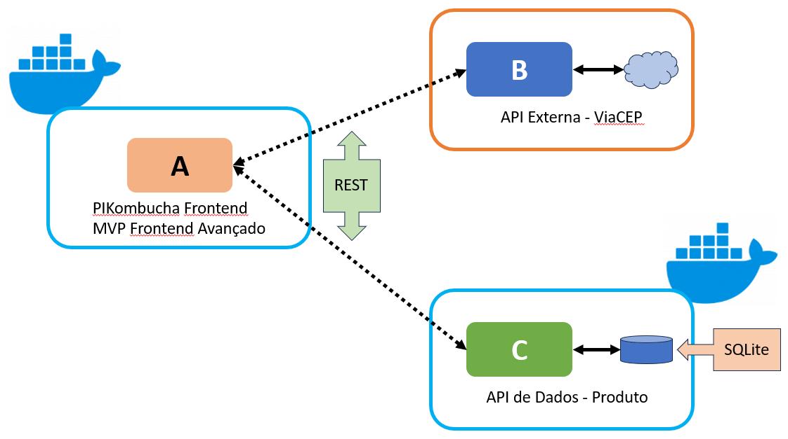

# PiKumbucha Web App

Welcome to Pikombucha, a React application dedicated to exploring and enjoying kombucha drinks!

<!-- TABLE OF CONTENTS -->

## Table of Contents

- [:notebook_with_decorative_cover:About the project](#notebook_with_decorative_coverabout-the-project)
  - [Arquitetura](#arquitetura)
  - [🛠️Technologies](#🛠️technologies)
  - [:electric_plug:Installation](#electric_pluginstallation)
  - [Docker](#docker)
- [:technologist:Developer](#technologistdeveloper)

<!-- ABOUT THE PROJECT -->

## :notebook_with_decorative_cover:About the project

Pikombucha is entirely a frontend application using React, designed to provide a seamless and responsive user experience without relying on a backend server. This approach ensures quick loading times and smooth interactions, leveraging modern frontend technologies to deliver content and functionality directly to your browser.

It is a frontend application developed using React to serve as an MVP for a product proposal that allows beverage management on the administrative area of the website. This was the MVP for the Advanced Frontend Sprint at PUC-RJ, and CRUD functionalities were added to allow adding, editing, removing, and viewing products, becoming part of the MVP for the Advanced Backend Sprint along with a REST API that saves address data in an SQLite database. The API is available in the [repositório](https://github.com/ANNEBORTOLI/api-puc-mvp-sprint-backend-avancado)..

On the cart page, it is possible to check postal codes using the external VIACEP API to simulate a delivery fee for the products.

The product query and database addition functionalities work without a backend, using a JSON file to load the necessary information, simulating a backend request (this was implemented in the Advanced Frontend Sprint).

Lets drink kumbucha! 📋✅

### Figma Link

https://www.figma.com/design/d2DjHTy8QMZ8S0a0nJY2mW/PI-Kombucha?node-id=9-718&t=h8FOdYphzjNtPOhj-1

### Architecture

- Frontend - Pikumbucha (this repo)
- REST API - [Acesse aqui](https://github.com/ANNEBORTOLI/api-puc-mvp-sprint-backend-avancado)
- API Externa Pública - [ViaCep](https://viacep.com.br/)
- Architecture image
<div align="left">
  
</div>
<br>

### 🛠️Technologies

<ul>
  <li><strong>React:</strong> A JavaScript library for building user interfaces.</li>
  <li><strong>Vite:</strong> A fast frontend build tool that focuses on speed and efficiency.</li>
  <li><strong>React Router DOM:</strong> Provides routing and navigation functionalities for React apps.</li>
  <li><strong>React Slick:</strong> A carousel component for React.</li>
</ul>

### :electric_plug:Installation

1. Clone the repo

```sh
   git clone https://github.com/ANNEBORTOLI/ftont-puc-mvp-sprint-backend-avancado-
   cd ftont-puc-mvp-sprint-backend-avancado-
```

2. Install dependencies.
   `npm install`

3. Availiable scripts:

- Development Mode:
  `npm run dev`

## Docker

1. In the folder root, execute:

```
  docker build -t frontend .
```

2. Execute the container:

```
  docker run -p 5173:5173 frontend
```

3. Open the URL

```
  http://localhost:5173/
```

## :technologist:Developer

- [Github](https://github.com/ANNEBORTOLI)
- [LinkedIn](https://www.linkedin.com/in/anne-bortoli/)
